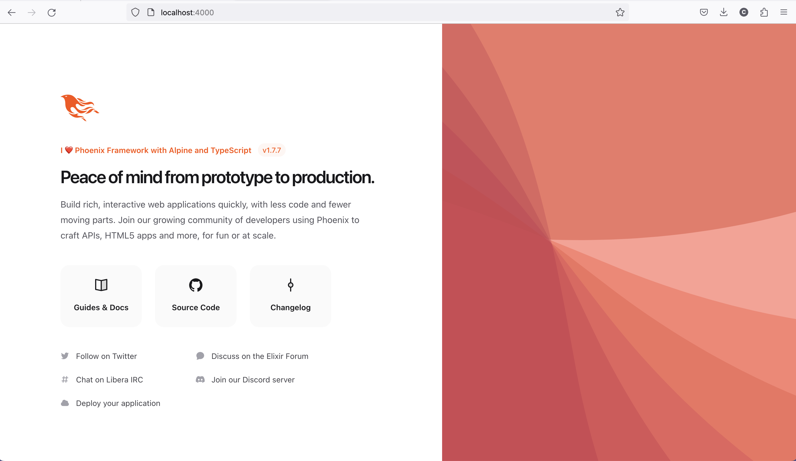
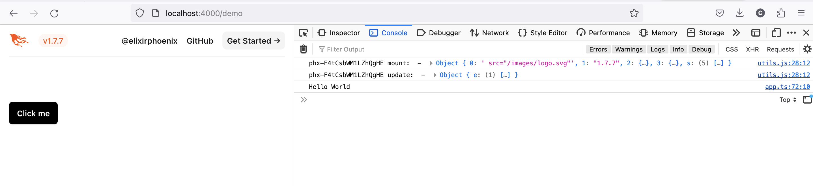

## Table of Contents

## Introduction

I've been working with Phoenix 1.7 for a few months now using the default JavaScript setup, but as the complexity of the front-end has grown, I've been looking for ways to improve the developer experience. I've been using TypeScript for a few years now, and I've been very happy with it, so I decided to try to use TypeScript in my Phoenix project.

Most of the information I found online was for older versions of Phoenix, so I decided to document my experience here. I will be using [esbuild](https://esbuild.github.io/) to transpile the TypeScript code to JavaScript and take advantage of the built-in tooling provided by the Phoenix Framework. I don't want to radically change the build process, I only want add the developer ergonomics I am used to from years of front-end development.

For this blog post, I will be starting with a fresh Phoenix 1.7 project. I also want to go beyond the typical "Hello World" example and show how to use TypeScript with [Phoenix LiveView](https://hexdocs.pm/phoenix_live_view/Phoenix.LiveView.html). I will be using the [Phoenix LiveView Hooks](https://hexdocs.pm/phoenix_live_view/js-interop.html#phoenix_live_view_hooks) to add some interactivity to the page, as well as [Alpine.js](https://alpinejs.dev/) which is commonly used with Phoenix for client-side interactivity.

## Create a Phoenix 1.7 project

To get started, let's create a new Phoenix project by following Phoenix's [documentation for getting up and running](https://hexdocs.pm/phoenix/up_and_running.html). I will not cover installing Elixir, Node.js or the database, this assumes you have a fully capable environment.

```bash
# Upgrade Hex to latest version
mix local.hex

# Install the Phoenix application generator
mix archive.install hex phx_new

# Bootstrap Phoenix
mix phx.new phoenix_typescript
```

After accepting the defaults, we need to configure the database in `config/dev.exs` and initialize the database. I will be using PostgreSQL, but you can use any database you want. I will be using Docker Compose to run PostgreSQL, but you can use any method you want. The following example will use the default values scaffolded by Phoenix, but you may want to change these values to match our environment.

```sh
# Go to the Phoenix directory
cd phoenix_typescript

# Create a docker-compose file
touch docker-compose.yaml
```

We can copy the following code into our `docker-compose.yaml` file.

```yaml
version: "3.9"
services:
  db:
    image: postgres:15.2
    restart: always
    environment:
      - POSTGRES_USER=postgres
      - POSTGRES_PASSWORD=postgres
      - POSTGRES_DB=phoenix_typescript_dev
    ports:
      - "5432:5432"
    volumes:
      - db:/var/lib/postgresql/data
volumes:
  db:
    driver: local
```

Now we can start the database and run the creation and migration tasks.

```sh
# Start the database
docker-compose up

# Create the db and run the migrations
mix ecto.create

# Start the Phoenix server
mix phx.server
```

We now have a working Phoenix application! You can visit [`localhost:4000`](http://localhost:4000) from our browser to see the default Phoenix welcome page.


## Set up TypeScript

Now let's take a look at the existing JavaScript setup. Phoenix uses [esbuild](https://esbuild.github.io/) to transpile and bundle the JavaScript code. The configuration is stored in `config/config.exs`:

```elixir
# Configure esbuild (the version is required)
config :esbuild,
  version: "0.17.11",
  default: [
    args:
      ~w(js/app.js --bundle --target=es2017 --outdir=../priv/static/assets --external:/fonts/* --external:/images/*),
    cd: Path.expand("../assets", __DIR__),
    env: %{"NODE_PATH" => Path.expand("../deps", __DIR__)}
  ]
```

We can see that the bundler has certain options set, such as the target and output directory. All modern JavaScript syntax is supported by esbuild, but newer syntax might not be supported by certain browsers. By setting `--target=es2017`, we tell esbuild to convert newer syntax to older syntax [as appropriate](https://esbuild.github.io/content-types/#javascript). We can also see that the input file will be `app.js`, when we migrate to TypeScript we will have to change this to `app.ts`.

esbuild supports TypeScript out of the box, so we don't need to install any additional dependencies. We can rename `app.js` to `app.ts` and update the configuration to use `app.ts` as the input file.

```bash
# Rename app.js to app.ts
mv assets/js/app.{js,ts}
```

```diff
diff --git a/config/config.exs b/config/config.exs
index 4eae6f7..aeffbb0 100644
--- a/config/config.exs
+++ b/config/config.exs
@@ -34,7 +34,7 @@ config :esbuild,
   version: "0.17.11",
   default: [
     args:
-      ~w(js/app.js --bundle --target=es2017 --outdir=../priv/static/assets --external:/fonts/* --external:/images/*),
+      ~w(js/app.ts --bundle --target=es2017 --outdir=../priv/static/assets --external:/fonts/* --external:/images/*),
     cd: Path.expand("../assets", __DIR__),
     env: %{"NODE_PATH" => Path.expand("../deps", __DIR__)}
   ]
```

Afterwards we can start the server and visit [`localhost:4000`](http://localhost:4000) to see the same welcome page as before. We can also see that the JavaScript code is still working as expected. This is because esbuild does handle TypeScript but [does not handle any type checking itself](https://esbuild.github.io/content-types/#typescript), we still need to run `tsc --noEmit` to handle type checking.

In order to run `tsc`, we need the TypesScript compiler. We can install it with `npm` into our `assets` directory. Before that, we want to initialize a `package.json`. Then we want to save it as a development dependency `package.json`. We can do this by running the following command:

```bash
# Install TypeScript into our assets directory and save it as a dev dependency
npm --prefix assets install typescript --save-dev
```

A `package.json` and `package-lock.json`file are created automatically, and we can see that `tsc` is listed as a dev dependency.

```bash
On branch main
Changes to be committed:
  (use "git restore --staged <file>..." to unstage)
        new file:   assets/package-lock.json
        new file:   assets/package.json
```

The content of the `package.json` is very minimal, only listing our dev dependency.

```json
{
  "devDependencies": {
    "typescript": "^5.2.2"
  }
}
```

Finally we need to create a minimal TypeScript configuration file. esbuild does not require a `tsconfig.json` file, but the TypeScript compiler does. We can create a minimal config file by running `npx --prefix assets tsc --init` in our `assets` directory.

```bash
# npx does not support the --prefix flag, so we need to cd into the assets directory
cd assets

# Initialize a tsconfig.json file
npx tsc --init

# Return to the root directory
cd ..
```

We can leave all the values to their defaults except for the `target` option. We want to set the `target` to `es2017` to match the target used by esbuild.

```diff
diff --git a/assets/tsconfig.json b/assets/tsconfig.json
index e075f97..91776fc 100644
--- a/assets/tsconfig.json
+++ b/assets/tsconfig.json
@@ -11,7 +11,7 @@
     // "disableReferencedProjectLoad": true,             /* Reduce the number of projects loaded automatically by TypeScript. */

     /* Language and Environment */
-    "target": "es2016",                                  /* Set the JavaScript language version for emitted JavaScript and include compatible library declarations. */
+    "target": "es2017",                                  /* Set the JavaScript language version for emitted JavaScript and include compatible library declarations. */
     // "lib": [],                                        /* Specify a set of bundled library declaration files that describe the target runtime environment. */
     // "jsx": "preserve",                                /* Specify what JSX code is generated. */
     // "experimentalDecorators": true,                   /* Enable experimental support for legacy experimental decorators. */
```

In Node.js, the `scripts` section of the `package.json` is [used to define scripts](https://docs.npmjs.com/cli/v10/using-npm/scripts) that can be run with `npm run <script>`. We can add a `typecheck` script to run the TypeScript compiler.

```diff
diff --git a/assets/package.json b/assets/package.json
index 04263dc..564a3fd 100644
--- a/assets/package.json
+++ b/assets/package.json
@@ -1,4 +1,7 @@
 {
+  "scripts": {
+    "typecheck": "tsc --noEmit --pretty"
+  },
   "devDependencies": {
     "typescript": "^5.2.2"
   }
```

Now we can run our `typecheck` script to see the errors in our `app.ts`. Remember to change the directory to the root Phoenix directory to run the following command, otherwise if we are in the `assets` directory we can omit the `--prefix assets` flag.

```bash
# Run the typecheck script
npm --prefix assets run typecheck
```

## Automatic type checking with watchers

We can add an alias to our Mix tasks to run the `typecheck` script. This will allow us to run `mix assets.typecheck` from our project root. We can add the following to our `mix.exs` file under the `aliases` function.

```diff
diff --git a/mix.exs b/mix.exs
index e7e6b2c..470decd 100644
--- a/mix.exs
+++ b/mix.exs
@@ -65,6 +65,7 @@ defmodule PhoenixTypescript.MixProject do
       "ecto.setup": ["ecto.create", "ecto.migrate", "run priv/repo/seeds.exs"],
       "ecto.reset": ["ecto.drop", "ecto.setup"],
       test: ["ecto.create --quiet", "ecto.migrate --quiet", "test"],
+      "assets.typecheck": ["cmd npm --prefix assets run typecheck"],
       "assets.setup": ["tailwind.install --if-missing", "esbuild.install --if-missing"],
       "assets.build": ["tailwind default", "esbuild default"],
       "assets.deploy": ["tailwind default --minify", "esbuild default --minify", "phx.digest"]
```

This helps us run the type check manually, but we want to run the type check automatically when files are changed in the project. The only change we make to our `typecheck` command is to pass the `--watch` flag to `tsc`. This will watch our files for changes and run the type check automatically. When passing arguments to a `package.json` script, we need to prefix it with `--` to separate the arguments for `npm` and the arguments for the script.

```bash
# An example of running the typecheck script with the --watch flag
npm --prefix assets run typecheck -- --watch
```

While that works, we want to run the type check automatically when we run `mix phx.server`. We can do that by adding our typecheck watcher command to our `config/dev.exs` file.

```diff
diff --git a/config/dev.exs b/config/dev.exs
index e702834..591530f 100644
--- a/config/dev.exs
+++ b/config/dev.exs
@@ -26,7 +26,8 @@ config :phoenix_typescript, PhoenixTypescriptWeb.Endpoint,
   secret_key_base: "4s+TpGoGfPgA4CEogO+83S26CXea4zHcpcQCKY7mwytLB4W2OXidoDYSQeUUPEcD",
   watchers: [
     esbuild: {Esbuild, :install_and_run, [:default, ~w(--sourcemap=inline --watch)]},
-    tailwind: {Tailwind, :install_and_run, [:default, ~w(--watch)]}
+    tailwind: {Tailwind, :install_and_run, [:default, ~w(--watch)]},
+    npm: ["--prefix", "assets", "run", "typecheck", "--", "--watch"]
   ]

 # ## SSL Support
```

Now if we run `mix phx.server` we can see that the type check is running in the background. If we make a change to `app.ts` and save it, we can see that the type check runs automatically and the errors are displayed in the console. If we open the page in the browser, we can see that the JavaScript code is still working as expected. esbuild is not blocked by the type check, it will still bundle the JavaScript code and reload the page as expected.

## Fixing TypeScript errors

The first two errors we see in `app.ts` are related to the type declarations for Phoenix and Phoenix Live View.

```bash
js/app.ts:21:22 - error TS2307: Cannot find module 'phoenix' or its corresponding type declarations.

21 import {Socket} from "phoenix"
                        ~~~~~~~~~

js/app.ts:22:26 - error TS2307: Cannot find module 'phoenix_live_view' or its corresponding type declarations.

22 import {LiveSocket} from "phoenix_live_view"
                            ~~~~~~~~~~~~~~~~~~~
```

Since these libraries don't ship their own type declarations, we need to look for them elsewhere. Fortunately, the [DefinitelyTyped](https://definitelytyped.github.io/) project has declarations for both of these libraries. We can install them with `npm` as dev dependencies.

```bash
# Install type declarations to dev dependencies
npm --prefix assets install @types/phoenix @types/phoenix_live_view --save-dev
```

With this, the errors are gone. We can also see that our `package.json` and `package-lock.json` have been updated with these dependencies. We can move on the the next error. We can see it is related to the `topbar` library used to display a progress bar on the top of the screen.

```bash
js/app.ts:14:20 - error TS7016: Could not find a declaration file for module 'topbar'. '/Users/carlos/Development/landing/assets/node_modules/topbar/topbar.min.js' implicitly has an 'any' type.
  Try `npm i --save-dev @types/topbar` if it exists or add a new declaration (.d.ts) file containing `declare module 'topbar';`

14 import topbar from "topbar"
                      ~~~~~~~~
```

This library is loaded from the `assets/vendor/` directory, and is part of the default Phoenix installation. Let's remove this hard-coded library and fetch the latest version from NPM:

```bash
# Remove the existing library file
rm assets/vendor/topbar.js

# Install topbar from NPM
npm --prefix assets install topbar --save
```

We also need to update the reference to the library in `app.ts`:

```diff
diff --git a/assets/js/app.ts b/assets/js/app.ts
index df0cdd9..70c1398 100644
--- a/assets/js/app.ts
+++ b/assets/js/app.ts
@@ -20,7 +20,7 @@ import "phoenix_html"
 // Establish Phoenix Socket and LiveView configuration.
 import {Socket} from "phoenix"
 import {LiveSocket} from "phoenix_live_view"
-import topbar from "../vendor/topbar"
+import topbar from "topbar"

 let csrfToken = document.querySelector("meta[name='csrf-token']").getAttribute("content")
 let liveSocket = new LiveSocket("/live", Socket, {params: {_csrf_token: csrfToken}})
```

We can see that the error no longer appears in our type check. But why? It turns out the newer version of the library is already typed, so we don't need to install any additional type declarations. We are now down to 2 errors, the next one being a null check:

```bash
js/app.ts:25:17 - error TS2531: Object is possibly 'null'.

25 let csrfToken = document.querySelector("meta[name='csrf-token']").getAttribute("content")
                   ~~~~~~~~~~~~~~~~~~~~~~~~~~~~~~~~~~~~~~~~~~~~~~~~~
```

Our script does not know if the `querySelector` will return a value or not, so we need to check for `null` before calling `getAttribute`. We can fix this by adding a null check to the code. We'll use the [optional chaining operator](https://developer.mozilla.org/en-US/docs/Web/JavaScript/Reference/Operators/Optional_chaining) to do this. This is an ES2020 feature, but thanks to esbuild with the `--target=es2017` flag, we can use it without any additional configuration.

```diff
diff --git a/assets/js/app.ts b/assets/js/app.ts
index 70c1398..653efb4 100644
--- a/assets/js/app.ts
+++ b/assets/js/app.ts
@@ -22,7 +22,7 @@ import {Socket} from "phoenix"
 import {LiveSocket} from "phoenix_live_view"
 import topbar from "topbar"

-let csrfToken = document.querySelector("meta[name='csrf-token']").getAttribute("content")
+let csrfToken = document.querySelector("meta[name='csrf-token']")?.getAttribute("content")
 let liveSocket = new LiveSocket("/live", Socket, {params: {_csrf_token: csrfToken}})

 // Show progress bar on live navigation and form submits
```

We are down to the last error about the `liveSocket` variable not existing in the global browser scope:

```bash
js/app.ts:44:8 - error TS2339: Property 'liveSocket' does not exist on type 'Window & typeof globalThis'.

44 window.liveSocket = liveSocket;
          ~~~~~~~~~~
```

To fix this, we will need to add a type declaration for the `liveSocket` variable. We can do this by adding a `global.d.ts` file to our `assets` directory. This file will be automatically loaded by the TypeScript compiler, and we can add our type declaration to it.

```bash
# Create a global.d.ts file
touch assets/global.d.ts
```

We now need to add the type declaration for the `liveSocket` variable. We can do this by adding the following code to our `global.d.ts` file:

```typescript
import { LiveSocket } from "phoenix_live_view";

declare global {
  interface Window {
    liveSocket: LiveSocket;
  }
}
```

We can see that the error is gone, and we have a working TypeScript setup!

## Integrating with Alpine.js

LiveView excels at interactivity that requires coordination with the backend, but we shouldn't have to go to the server for purely client-side interactions. To that end, Alpine.js was developed to facilitate implementing client-side interactivity. It has been adopted as part of the [PETAL stack](https://thinkingelixir.com/petal-stack-in-elixir/), composed of **P**hoenix Framework, **E**lixir, **T**ailwind CSS, **A**lpine.js, and **L**iveView. The default Phoenix installation comes with everything except Alpine.js, so we need to install it ourselves.

```bash
# Install Alpine.js
npm --prefix assets install alpinejs --save

# Install the type declarations
npm --prefix assets install @types/alpinejs --save-dev
```

Now we need to initialize Alpine.js in our `app.ts` file. Following the [Alpine.js documentation](https://alpinejs.dev/essentials/installation), we add the following code to the end of our `app.ts` file:

```typescript
// Import and initialize Alpine.js
import Alpine from "alpinejs";
window.Alpine = Alpine;
Alpine.start();
```

While this works, we can see a type error from binding Alpine to the window. This is not strictly required for Alpine to function, but the docs recommend this approach to allow tinkering with Alpine from the browser developer tools during development.

```bash
js/app.ts:48:8 - error TS2339: Property 'Alpine' does not exist on type 'Window & typeof globalThis'.

48 window.Alpine = Alpine;
          ~~~~~~
```

We can fix this by adding a type declaration for the `Alpine` variable in our `global.d.ts` file.

```diff
diff --git a/assets/global.d.ts b/assets/global.d.ts
index 82143f6..def88aa 100644
--- a/assets/global.d.ts
+++ b/assets/global.d.ts
@@ -1,7 +1,9 @@
+import { Alpine } from "alpinejs";
 import { LiveSocket } from "phoenix_live_view";

 declare global {
   interface Window {
     liveSocket: LiveSocket;
+    Alpine: Alpine;
   }
 }
```

On a normal web server this would be enough to get started with Alpine.js, but we are using LiveView to render our page. LiveView uses [morphdom](https://github.com/patrick-steele-idem/morphdom) to update the DOM from the server. This means that Alpine.js will not be able to see the changes made by LiveView and Alpine.js will lose track on the elements its attached to. This can be fixed using the `onBeforeElUpdated` liveSocket lifecycle hook to preserve the Alpine.js state.

```diff
diff --git a/assets/js/app.ts b/assets/js/app.ts
index e12f521..8221d5d 100644
--- a/assets/js/app.ts
+++ b/assets/js/app.ts
@@ -23,7 +23,13 @@ import {LiveSocket} from "phoenix_live_view"
 import topbar from "topbar"

 let csrfToken = document.querySelector("meta[name='csrf-token']")?.getAttribute("content")
-let liveSocket = new LiveSocket("/live", Socket, {params: {_csrf_token: csrfToken}})
+let liveSocket = new LiveSocket("/live", Socket, {params: {_csrf_token: csrfToken},   dom: {
+    onBeforeElUpdated(from, to) {
+      if (from._x_dataStack) {
+        window.Alpine.clone(from, to)
+      }
+    }
+  }})

 // Show progress bar on live navigation and form submits
 topbar.config({barColors: {0: "#29d"}, shadowColor: "rgba(0, 0, 0, .3)"})
```

This works great, but we can see that we have new errors in our type check:

```bash
js/app.ts:27:5 - error TS2322: Type '(from: HTMLElement, to: HTMLElement) => void' is not assignable to type '(fromEl: HTMLElement, toEl: HTMLElement) => boolean'.
  Type 'void' is not assignable to type 'boolean'.

27     onBeforeElUpdated(from, to) {
       ~~~~~~~~~~~~~~~~~

js/app.ts:28:16 - error TS2339: Property '_x_dataStack' does not exist on type 'HTMLElement'.

28       if (from._x_dataStack) {
                  ~~~~~~~~~~~~
```

The first error indicates that we need to return a boolean from the lifecycle hook rather than returning nothing (`void`), so we can `return false` to fix that error. For the following error, we can use one of the type declarations provided by `@types/alpinejs` in order to create an [intersection type](https://www.typescriptlang.org/docs/handbook/2/objects.html#intersection-types) of `HTMLElement` with Alpine.js' augmentations. To do this, we would need to modify our `app.ts` with the following:

```diff
diff --git a/assets/js/app.ts b/assets/js/app.ts
index e12f521..e8b8468 100644
--- a/assets/js/app.ts
+++ b/assets/js/app.ts
@@ -23,7 +23,15 @@ import {LiveSocket} from "phoenix_live_view"
 import topbar from "topbar"

 let csrfToken = document.querySelector("meta[name='csrf-token']")?.getAttribute("content")
-let liveSocket = new LiveSocket("/live", Socket, {params: {_csrf_token: csrfToken}})
+let liveSocket = new LiveSocket("/live", Socket, {params: {_csrf_token: csrfToken},   dom: {
+    onBeforeElUpdated(from, to) {
+      const stack = (from as HTMLElement & XAttributes)._x_dataStack;
+      if (stack) {
+        Alpine.clone(from, to);
+      }
+      return false;
+    }
+  }})

 // Show progress bar on live navigation and form submits
 topbar.config({barColors: {0: "#29d"}, shadowColor: "rgba(0, 0, 0, .3)"})
@@ -40,6 +48,6 @@ liveSocket.connect()
 window.liveSocket = liveSocket

 // Import and initialize Alpine.js
-import Alpine from "alpinejs";
+import Alpine, { XAttributes } from "alpinejs";
 window.Alpine = Alpine;
 Alpine.start();
```

To finish up, we can add a simple Alpine.js component to our application and see it in action. Taking inspiration from the [Alpine.js documentation](https://alpinejs.dev/start-here), we can add the following code to our home page template:

```diff
diff --git a/lib/phoenix_typescript_web/controllers/page_html/home.html.heex b/lib/phoenix_typescript_web/controllers/page_html/home.html.heex
index e9fc48d..358ab0c 100644
--- a/lib/phoenix_typescript_web/controllers/page_html/home.html.heex
+++ b/lib/phoenix_typescript_web/controllers/page_html/home.html.heex
@@ -46,8 +46,13 @@
         fill="#FD4F00"
       />
     </svg>
+
     <h1 class="text-brand mt-10 flex items-center text-sm font-semibold leading-6">
-      Phoenix Framework
+      <span
+        x-data="{ message: 'I ❤️  Phoenix Framework with Alpine and TypeScript' }"
+        x-text="message"
+      >
+      </span>
       <small class="bg-brand/5 text-[0.8125rem] ml-3 rounded-full px-2 font-medium leading-6">
         v<%= Application.spec(:phoenix, :vsn) %>
       </small>
```

If everything is working correctly, we should see the following:



## Typed client hooks

[Client Hooks](https://hexdocs.pm/phoenix_live_view/js-interop.html#client-hooks-via-phx-hook) are a way for Phoenix to run client-side JavaScript when an element is added, updated, or removed by the server. For this, we need to add a `phx-hook` attribute to the element, as well as a unique `id`. For example, we can run a hook automatically on page load by adding the following to our `home.html.heex` template:

```diff
diff --git a/lib/phoenix_typescript_web/controllers/page_html/home.html.heex b/lib/phoenix_typescript_web/controllers/page_html/home.html.heex
index 358ab0c..dcd7e3f 100644
--- a/lib/phoenix_typescript_web/controllers/page_html/home.html.heex
+++ b/lib/phoenix_typescript_web/controllers/page_html/home.html.heex
@@ -47,7 +47,11 @@
       />
     </svg>

-    <h1 class="text-brand mt-10 flex items-center text-sm font-semibold leading-6">
+    <h1
+      phx-hook="HomeHeader"
+      id="header"
+      class="text-brand mt-10 flex items-center text-sm font-semibold leading-6"
+    >
       <span
         x-data="{ message: 'I ❤️  Phoenix Framework with Alpine and TypeScript' }"
         x-text="message"
```

When loading the home page of our Phoenix server, we'll see... nothing[^1]! That's because we haven't defined the hook yet. Let's add it to our `app.ts` file:

```diff
diff --git a/assets/js/app.ts b/assets/js/app.ts
index e8b8468..13b58ad 100644
--- a/assets/js/app.ts
+++ b/assets/js/app.ts
@@ -22,8 +22,19 @@ import {Socket} from "phoenix"
 import {LiveSocket} from "phoenix_live_view"
 import topbar from "topbar"

+// Add example hook
+const Hooks = {
+  HomeHeader: {
+    mounted() {
+      console.log("HomeHeader mounted on element: ", this.el)
+    },
+  },
+};
+
 let csrfToken = document.querySelector("meta[name='csrf-token']")?.getAttribute("content")
-let liveSocket = new LiveSocket("/live", Socket, {params: {_csrf_token: csrfToken},   dom: {
+let liveSocket = new LiveSocket("/live", Socket, {
+  hooks: Hooks,
+  params: {_csrf_token: csrfToken},
+  dom: {
     onBeforeElUpdated(from, to) {
       const stack = (from as HTMLElement & XAttributes)._x_dataStack;
       if (stack) {
```

While this works, we get a type error in our type check:

```bash
js/app.ts:29:59 - error TS2339: Property 'el' does not exist on type '{ mounted(): void; }'.

29       console.log("HomeHeader mounted on element: ", this.el)
                                                             ~~
```

This can be fixed by using another type declaration from `@types/phoenix_live_view` along with TypeScript's `Partial` utility type, which sets all properties of a type to optional. We can add the following to our `app.ts` file to get rid of the error and have a fully typed hook

```diff
diff --git a/assets/js/app.ts b/assets/js/app.ts
index fbccd94..9768e86 100644
--- a/assets/js/app.ts
+++ b/assets/js/app.ts
@@ -19,11 +19,11 @@
 import "phoenix_html"
 // Establish Phoenix Socket and LiveView configuration.
 import {Socket} from "phoenix"
-import {LiveSocket} from "phoenix_live_view"
+import {LiveSocket, ViewHook} from "phoenix_live_view"
 import topbar from "topbar"

 // Add example hook
-const Hooks = {
+const Hooks: { [name: string]: Partial<ViewHook>} = {
   HomeHeader: {
     mounted() {
       console.log("HomeHeader mounted on element: ", this.el)
```

## Typed client-server communication

The final issue I encountered when working with TypeScript was how to type events sent from Phoenix to the front-end through LiveView's [push_event](https://hexdocs.pm/phoenix_live_view/Phoenix.LiveView.html#push_event/3). Let's add a route with a LiveView controller to our `router.ex` file:

```diff
diff --git a/lib/phoenix_typescript_web/router.ex b/lib/phoenix_typescript_web/router.ex
index da82283..bbfea43 100644
--- a/lib/phoenix_typescript_web/router.ex
+++ b/lib/phoenix_typescript_web/router.ex
@@ -18,6 +18,7 @@ defmodule PhoenixTypescriptWeb.Router do
     pipe_through :browser

     get "/", PageController, :home
+    live "/demo", DemoController
   end

   # Other scopes may use custom stacks.
```

We also need to add the controller in `lib/phoenix_typescript_web/controllers/demo_controller.ex`:

```elixir
defmodule PhoenixTypescriptWeb.DemoController do
  use PhoenixTypescriptWeb, :live_view

  def handle_event("click", _, socket) do
    {:noreply,
     socket
     |> push_event("demo-event", %{name: "World"})}
  end

  def render(assigns) do
    ~H"""
    <button
      type="button"
      class="rounded-md bg-black px-3.5 py-2.5 text-sm font-semibold text-white shadow-sm focus-visible:outline focus-visible:outline-2 focus-visible:outline-offset-2"
      phx-click="click"
    >
      Click me
    </button>
    """
  end
end
```

We also need to add the event listener in our `app.ts` file, the following can be added to the end of the file:

```typescript
// Add handler for custom event
window.addEventListener(`phx:demo-event`, async (e) => {
  console.log(`Hello ${e.detail.name}`);
});
```

If we open the new route in our browser, we see our button and if we click on it can it works as expected:



This works, but we get a type error in our type check:

```bash
js/app.ts:72:26 - error TS2339: Property 'detail' does not exist on type 'Event'.

72   console.log(`Hello ${e.detail.name}`);
                            ~~~~~~
```

Events handled by the front-end are of type [CustomEvent](https://developer.mozilla.org/en-US/docs/Web/API/CustomEvent) and are unique in that they are typed according to the event name. We can use this to our advantage by creating a type declaration for our event. We can add the following to our `global.d.ts` file:

```diff
diff --git a/assets/global.d.ts b/assets/global.d.ts
index 71cae7a..09bfbb2 100644
--- a/assets/global.d.ts
+++ b/assets/global.d.ts
@@ -6,4 +6,8 @@ declare global {
     liveSocket: LiveSocket;
     Alpine: Alpine;
   }
+
+  interface WindowEventMap {
+    "phx:demo-event": CustomEvent<{ name: string }>;
+  }
 }
```

With this declaration, we can see that the type error is gone and we have a fully typed client-server communication, including autocompletion in our IDE when accessing the `e.detail` property.

## Conclusion

I had to comb through many different sources to get this setup up and running, so I hope having it all in one place will help other Phoenix developers to get started with TypeScript in their projects. In a future post, I will cover how to deploy this setup to production. If you have any questions or suggestions, feel free to reach out to me on [Twitter](https://twitter.com/disusered) or [Mastodon](https://tilde.zone/@disusered).

---

[^1]: Nothing in the web page, but we will see an error in the console saying `unknown hook found for "HomeHeader"`
